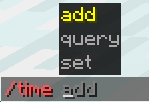

<h1 align="center">
  
</h1>

**Brigo** brings modern Brigadier-style command suggestions and autocomplete to legacy Minecraft versions.

  

## What is brigo?

Brigo is a mod that brings Brigadier-style command suggestions, syntax highlighting, and argument previews to older Minecraft versions.
It works on the **client side** to improve the command UI on most servers, but can also be installed **server-side** to provide deeper integration, such as custom command trees and better suggestion accuracy.

## How do I use it?

Brigo works out of the box on most legacy servers, but installing it on both client and server provides the best experience.
